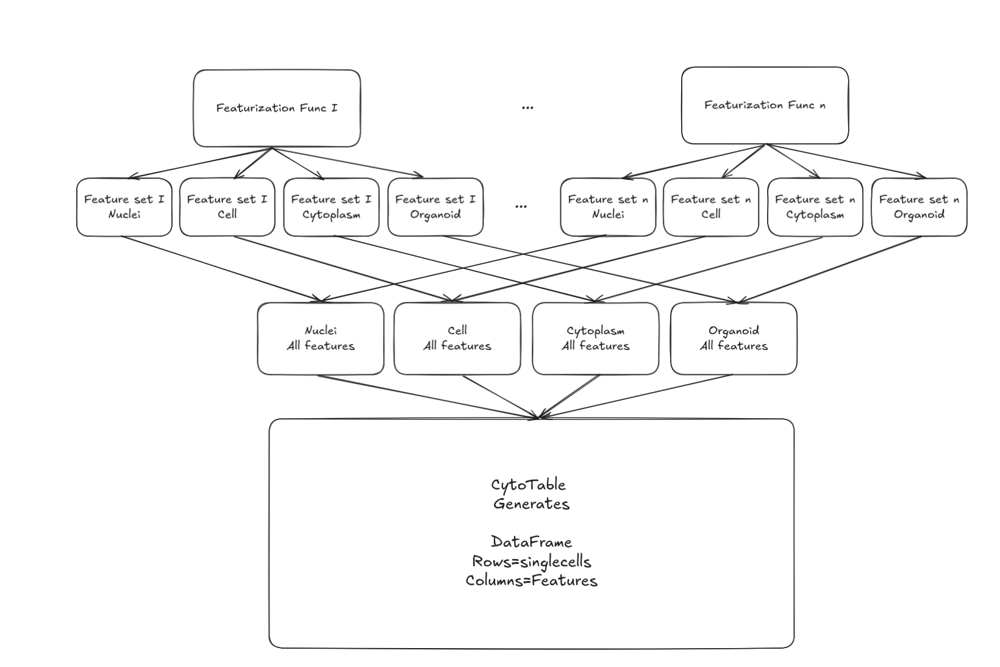

# Featurization

The approach to the featurization is to run each feature extraction function for each cell compartment for each channel in a distributed manner.
The results are then combined into a single dataframe for each cell compartment and channel.
Distinct features from this dataframe are saved as parquet files.
These parquet files are then merged by the following cell compartments as:
- Nuclei
- Cell
- Cytoplasm
- Organoid

These are stored as related tables in a SQLite database.
The SQLite database tables are then integrated as a single-cell feature table using CytoTable.

## Running the featurization
A parent/child approach is used to perform featurization.
Each parent process runs child processes.
Each grandparent process runs multiple parent processes.
### The grandparent process
The grandparent process spins off the parent processes.
Where each parent process is responsible for the well and FOV of a given organoid(s).
### The parent process
The parent process is responsible for running the child processes.
Where each child process is responsible for a given cell compartment and channel.
### The child process
The child process is responsible for running the feature extraction functions.
Where each feature extraction function is run in a separate process.
The child process is responsible for saving the results to a parquet file.
The child process ultimately recieves arguments from the parent process to run the feature extraction functions on either CPU or GPU.

#### Example of the grandparent process through the parent process to the child process
* Grandparent process spins of the parent process for Well 1, FOV 1
* Parent process spins off the child process for AreaSizeShape feauture extraction
* The child process runs the AreaSizeShape feature extraction function for teach channel and compartment and saves the results to a parquet file

For this dataset we have:
* 5 channels
* 4 compartments

We extract features for each of the feature types:
* AreaSizeShape (5 channels * 4 compartments = 20 parquet files)
* Colocalization (10 channel combinations * 4 compartments = 40 parquet files)
* Granularity (5 channels * 4 compartments = 20 parquet files)
* Intensity (5 channels * 4 compartments = 20 parquet files)
* Neighbors (one metric at one compartment level = 1 parquet file)
* Texture (5 channels * 4 compartments = 20 parquet files)

So each parent process will result in the child processes generating 121 parquet files per well and FOV combination.

Usage of featurization vs feature extraction:
* Featurization: The process of running the feature extraction functions on the images and saving the results to a parquet file.
* Feature extraction: The process of extracting features from the images using the feature extraction functions.
